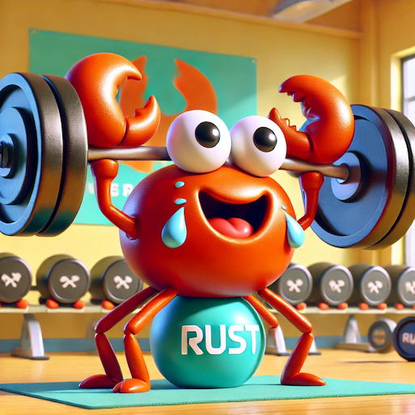

## Colosseum Gym August 2024

Solana's Radar Hackathon Prep: [Colosseum Radar](https://www.colosseum.org/)

### Length

Gym will start on Monday August 5th 2024 and will conclude on September 1st 2024 (The day before hackathon starts)

### Content

- Roughly 2 weeks of [Rust](https://doc.rust-lang.org/book/title-page.html)
- Roughly 2 weeks of [Anchor](https://www.anchor-lang.com/) + [Solana](https://solana.com/developers)

### Rust

We will only cover 8 chapters! The rest you can pick up as you go, especially [Lifetime](https://doc.rust-lang.org/book/ch10-00-generics.html).

- Chapter 1: [Getting Started](https://doc.rust-lang.org/book/ch01-00-getting-started.html)
- Chapter 3: [Common Programming Concepts](https://doc.rust-lang.org/book/ch03-00-common-programming-concepts.html)
- Chapter 4: [Understanding Ownership](https://doc.rust-lang.org/book/ch04-00-understanding-ownership.html)
- Chapter 5: [Using Structs to Structure Related Data](https://doc.rust-lang.org/book/ch05-00-structs.html)
- Chapter 6: [Enums and Pattern Matching](https://doc.rust-lang.org/book/ch06-00-enums.html)
- Chapter 7: [Managing Growing Projects with Packages, Crates, and Modules](https://doc.rust-lang.org/book/ch07-00-managing-growing-projects-with-packages-crates-and-modules.html)
- Chapter 8: [Common Collections](https://doc.rust-lang.org/book/ch08-00-common-collections.html)
- Chapter 9: [Error Handling](https://doc.rust-lang.org/book/ch09-00-error-handling.html)

Note:

- Chapter 2: is for your first homework [Programming a Guessing Game](https://doc.rust-lang.org/book/ch02-00-guessing-game-tutorial.html)

### Anchor

Coming soon!

### Solana

Coming soon!

© Copyright 2024 Bot Mechanic - MIT License
